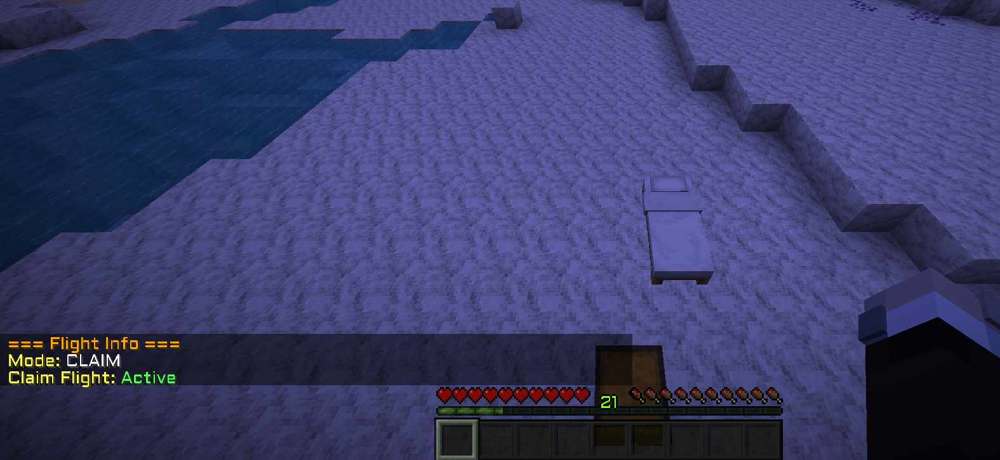
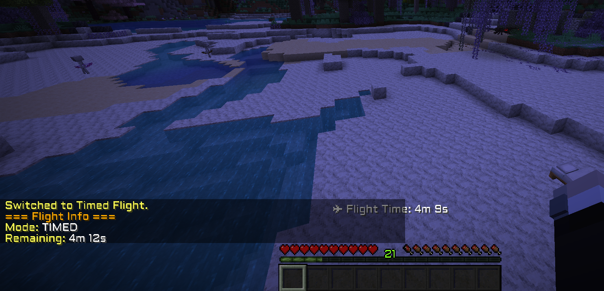
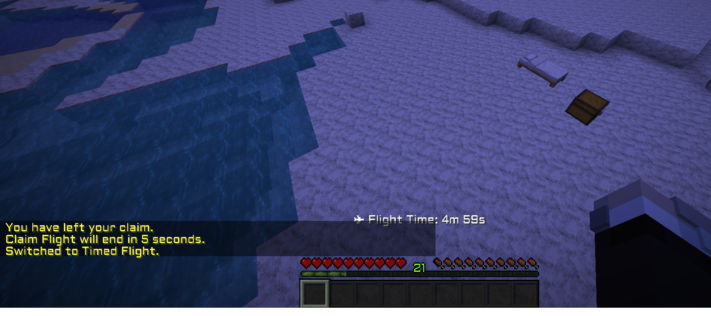
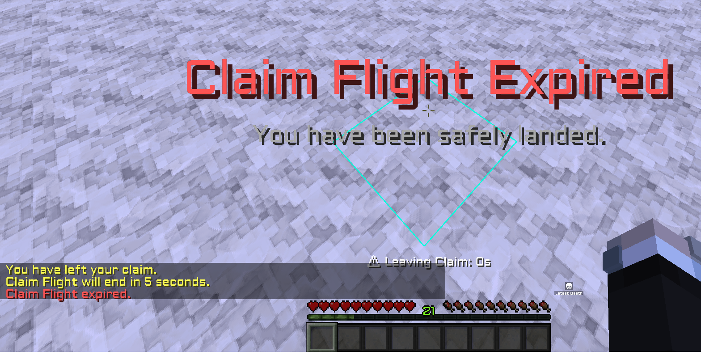

# BlzdFly

A lightweight flight management plugin for Paper and Purpur servers featuring timed flight, permanent flight, claim-based flight, safe landing, Bedrock-style flight controls, and GriefDefender integration.

## Features

### Timed Flight

* Grant players a configurable amount of flight time.
* Flight time only decreases while actively flying.
* Automatic safe landing when flight time expires.

### Permanent Flight

* Unlimited flight for players with the appropriate permission.

### Claim Flight

* Allows players to fly within claims they own.
* Automatic claim boundary detection using GriefDefender.
* Configurable grace period when leaving a claim.
* Automatically switches to Timed Flight if available.
* Safe landing if no other flight mode is available.

### Bedrock Flight

* Optional Bedrock-style flight controls.
* Players stop instantly when movement keys are released.
* Uses Purpur's player input API for accurate movement detection.

### Safety Features

* Safe landing on flight expiry.
* Safe landing after server restarts.
* Prevents unintended permanent flight after reconnecting.
* Automatic flight mode tracking.

### Quality of Life

* Tab completion for commands.
* Flight information command.
* Configurable settings.
* Lightweight and simple to use.

---

## Requirements

* Java 21+
* Paper 1.21.11+
* Purpur 1.21.11+ (recommended for Bedrock Flight support)

### Optional Dependencies

* GriefDefender (for Claim Flight)

---

# Screenshots

## Flight Information



## Timed Flight Information



## Switching to Timed Flight



## Claim Flight Expired



---

## Commands

### Player Commands

| Command     | Description                     |
| ----------- | ------------------------------- |
| `/fly`      | Toggle available flight mode    |
| `/fly info` | View current flight information |

### Admin Commands

| Command                       | Description                 |
| ----------------------------- | --------------------------- |
| `/fly give <player> <time>`   | Give flight time            |
| `/fly remove <player> <time>` | Remove flight time          |
| `/fly set <player> <time>`    | Set flight time             |
| `/fly time <player>`          | View remaining flight time  |
| `/fly reload`                 | Reload plugin configuration |

### Debug Commands (Admin Only)

| Command           | Description                       |
| ----------------- | --------------------------------- |
| `/fly claimtest`  | Check if currently inside a claim |
| `/fly ownercheck` | Check claim ownership             |
| `/fly claiminfo`  | View claim information            |

---

## Permissions

| Permission          | Description                               |
| ------------------- | ----------------------------------------- |
| `blzdfly.timed`     | Allows use of Timed Flight                |
| `blzdfly.claim`     | Allows use of Claim Flight                |
| `blzdfly.permanent` | Allows use of Permanent Flight            |
| `blzdfly.admin`     | Allows access to admin and debug commands |

---

## Time Formats

The following formats are supported:

```text
30s
5m
30m
1h
12h
24h
```

Examples:

```text
/fly give Steve 30m
/fly give Steve 2h
/fly set Steve 24h
```

---

## Configuration

Default configuration:

```yaml
# Show flight information in the action bar.
actionbar:
  enabled: true

flight:
  # Bedrock-style flight.
  # Players stop instantly when movement keys are released.
  bedrock-flight: false

claim-flight:
  # Seconds a player may remain outside their claim
  # before Claim Flight expires.
  grace-seconds: 5
```

---

## Flight Modes

### Timed Flight

Players with `blzdfly.timed` may use flight while they have remaining flight time.

Flight time decreases only while actively flying.

### Claim Flight

Players with `blzdfly.claim` may fly inside claims they own.

When leaving a claim:

1. A configurable grace period begins.
2. Returning to the claim restores Claim Flight.
3. If Timed Flight is available, flight automatically switches to Timed Flight.
4. Otherwise the player is safely landed.

### Permanent Flight

Players with `blzdfly.permanent` have unlimited flight access.

---

## Version

Current Release: **v1.0.1**

---

## Author

Created by **Blzd**
